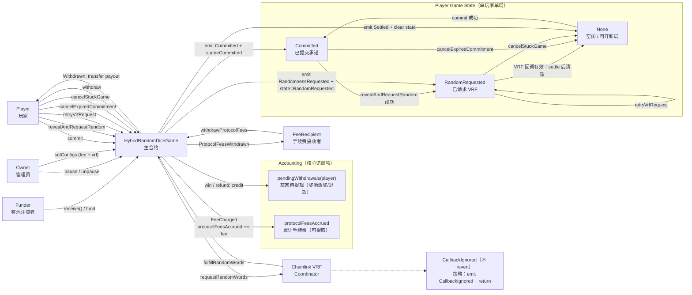
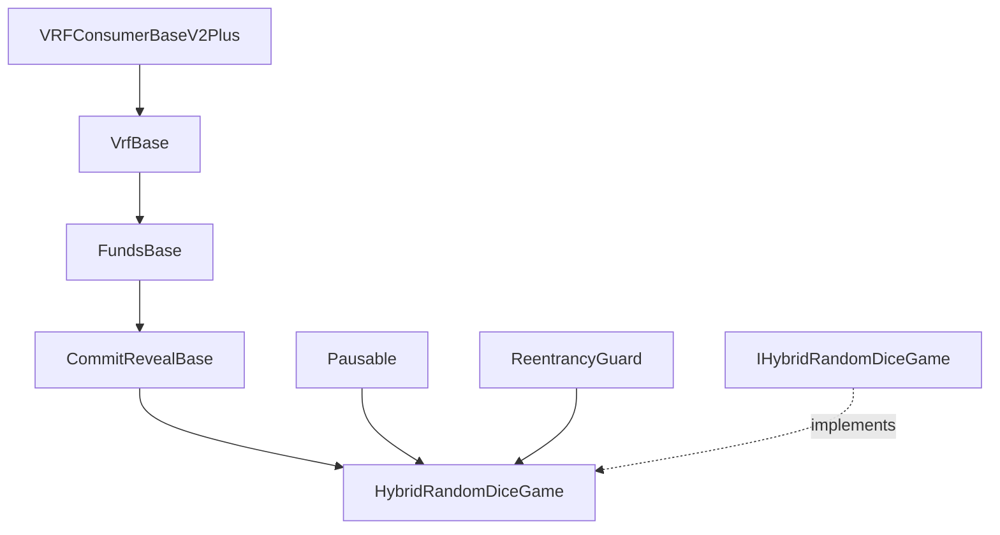
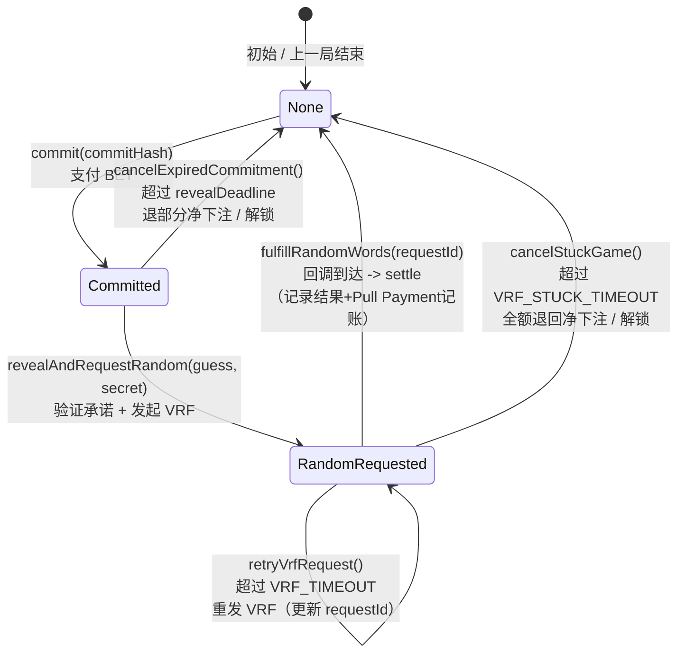
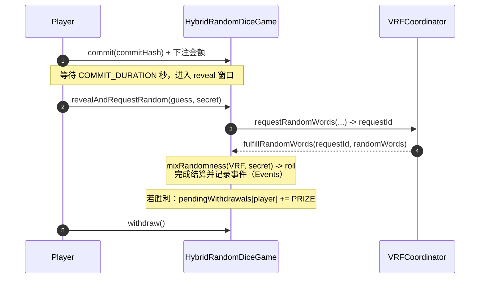
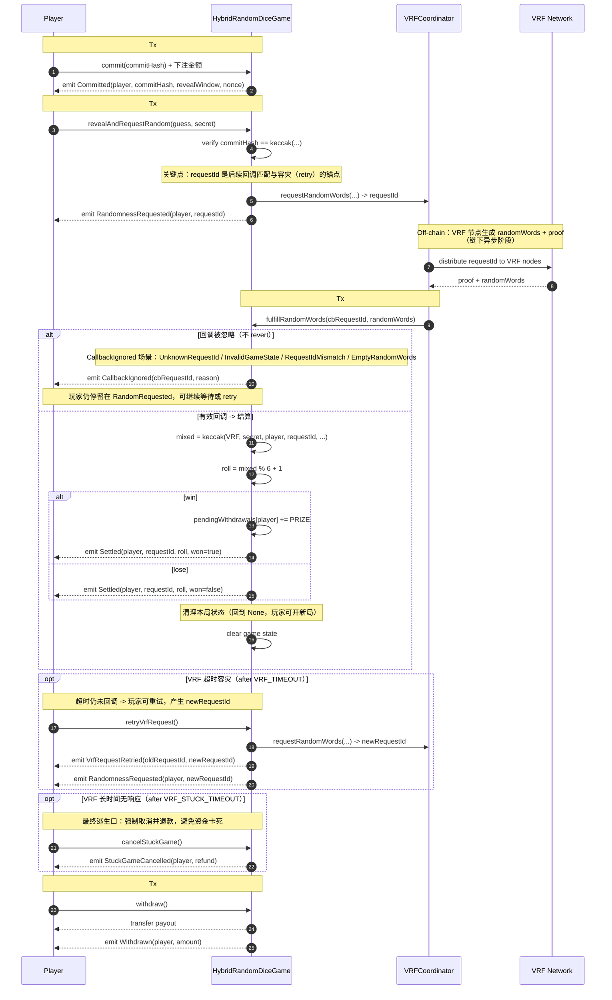
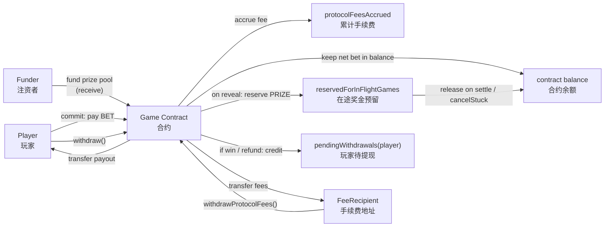

   

> 一个生产级的链上骰子游戏合约，采用 **Commit-Reveal + Chainlink VRF 混合随机** 方案，
> 解决链上游戏的随机数可预测、资金卡死、并发结算透支等核心安全问题。

## TL;DR

- 🎲 **双熵源混合随机**：Commit-Reveal 绑定玩家输入 + Chainlink VRF 提供可验证随机，任一方无法单独操控结果
- 🔓 **完整逃生机制**：reveal 超时可取消、VRF 超时可重试、VRF 卡死可强制退出，资金永不被锁死
- 💰 **并发安全**：in-flight reserve 机制防止多玩家同时结算导致奖池透支
- 🔍 **前端友好**：GameLens 聚合层，一次 RPC 调用返回完整 UI 数据

## （一）项目简介

**Hybrid Random Dice Game** 是一个基于以太坊（EVM）构建的、具有**双重随机性保障**的去中心化骰子游戏参考实现。

传统的链上随机数往往面临两大难题：要么依赖区块哈希容易被矿工操纵，要么单纯依赖预言机容易被抢跑（Front-running）。本项目采用 **Commit-Reveal（承诺-揭示）** 模式结合 **Chainlink VRF（可验证随机函数）**，构建了一套无法被预测、无法被操控的混合随机数机制。

此外，项目引入了独特的 **`GameLens` 架构**，将复杂的链上状态聚合为前端友好的数据结构，极大地降低了前端集成的复杂度与 RPC 请求量，是 Web3 全栈游戏开发的最佳实践范例。

### 1.1 玩家指南：如何开始游戏🎲

本游戏采用 **Commit-Reveal** 机制来保证公平性，因此与普通的“点击即开奖”游戏流程略有不同，请按照以下步骤操作：

1. **💰 下注 (Commit)**

   - 选择一个你觉得幸运的骰子点数（1-6）。
   - 点击 **Commit** 按钮并支付 **0.001 ETH**。
   - *幕后机制：此时你的猜测和本地生成的密钥会被加密哈希后提交上链，任何人无法提前知晓你的选择。*

2. **⏳ 等待锁定 (Wait)**

   - 提交成功后，进入 **60秒** 的锁定冷静期。
   - 这是为了防止区块重组攻击，请耐心等待倒计时结束。

3. **🔓 揭示 (Reveal)**

   - 倒计时结束后，**Reveal** 按钮变亮。

   - **重要：** 你有 **120秒** 的时间窗口点击此按钮。

   - 点击后，前端会将你最初的猜测和密钥提交给合约进行验证，并触发 Chainlink VRF 获取真随机数。

     *⚠️ 注意：如果你超时未揭示，将被视为放弃，资金会因过期仅允许退回部分。*

4. **🎰 开奖 (Settlement)**

   - 等待几秒钟（取决于 Chainlink VRF 的回调速度），随机数生成完毕。
   - 如果骰子点数与你的猜测一致，你将获得 **5倍 (0.005 ETH)** 的奖金！

5. **💸 提现 (Withdraw)**

   - 奖金会自动累积在合约的“待提现余额”中。
   - 你可以随时点击 **Withdraw** 将所有奖金提取到你的钱包。

> **Q: 为什么要等两步（Commit + Reveal）这么麻烦？** 
>
> **A:** 如果允许直接下注开奖，恶意攻击者可以监视内存池（Mempool），一旦发现随机数对自己不利就回滚交易。通过先“下注并锁定”，再“揭示并开奖”，我们彻底杜绝了这种作弊可能，确保每一局游戏都是绝对公平的。

### 1.2 核心安全痛点与对应机制

- **随机数安全（Anti-predict / Anti-bias）**
  - **Commit-Reveal**：玩家先提交 `commitHash = keccak256(player, guess, secret, contract, chainId, nonce)`，揭示时验证，降低 mempool 预测与复制输入风险；
  - **VRF 可验证随机**：Reveal 后发起 Chainlink VRF 请求，随机性由链下网络提供并可在链上验证；
  - **Hybrid Mix（双熵源混合）**：结算时将 VRF 随机与玩家 secret 混合，降低“单一熵源失效/被操控”的单点风险。

- **资金不被“卡死”（Escape Hatches）**
  - **Reveal 窗口**：Commit 后必须在指定时间窗口内 Reveal；错过时间窗口可 `cancelExpiredCommitment()`（惩罚性退款，退回净下注的一半）；
  - **VRF 超时重试**：VRF 超过 `VRF_TIMEOUT = 10 minutes` 未回调，允许 `retryVrfRequest()`（最多重试次数 `MAX_RETRIES = 3`）；
  - **VRF 长时间无响应强制退出**：超过 `VRF_STUCK_TIMEOUT = 24 hours` 可 `cancelStuckGame()` 全额退回净下注（不计手续费）。

- **并发资金安全（No prize overdraft）**
  - **In-flight Reserve（在途局预留金）**：当玩家进入等待 VRF 状态时，立即把本局潜在奖金计入 `reservedForInFlightGames`，避免多玩家并发 reveal 导致“奖池只够一局却通过多局检查”的资金透支问题。

- **可观测性（Observability-first）**
  - 关键状态变更与结算结果以 **Events** 记录，便于 subgraph/数据平台追踪与回放；
  - 链上保留必要状态（例如 `LastResult`），历史靠事件索引，减少链上存储膨胀。

- **前端 / 集成友好（Lens 聚合查询）**
  - `GameLens` 是只读聚合器：一次 `eth_call` 返回 `PlayerDashboard`（按钮可用性、倒计时、nextAction 等）与 `GlobalInfo`（余额/预留/手续费等），降低前端多次 RPC 拼装复杂度。

### 1.3 与其他方案对比

| 方案 | 随机数安全 | VRF 故障处理 | 并发安全 | 资金逃生 |
|------|-----------|-------------|---------|---------|
| 纯 Blockhash | ❌ 矿工可操控 | N/A | ❌ 无 | ❌ 无 |
| 纯 VRF | ⚠️ 单熵源 | ❌ 永久卡死 | ⚠️ 部分 | ❌ 无 |
| 纯 Commit-Reveal | ⚠️ 玩家可放弃 | N/A | ❌ 无 | ⚠️ 部分 |
| **本项目** | ✅ 双熵源混合 | ✅ retry + cancel | ✅ in-flight reserve | ✅ 完整 |

## （二）项目结构说明与继承链

### 2.1 总览图

**系统交互总览**：一张图同时展示外部角色（玩家 / VRF / 管理员 / 手续费接收者 / 注资者）、单玩家单局状态机、以及 Pull Payment 结算路径，帮助快速理解“怎么玩 + 怎么结算 + 怎么运维”。



**主流程**：`commit → revealAndRequestRandom → VRF 回调 settle → state 回到 None（可开新局）`。

**容灾分支**：

- `cancelExpiredCommitment`：reveal 超时，惩罚性退款 `netBet/2`；
- `retryVrfRequest`：超过 `VRF_TIMEOUT`，重发 VRF 并更新 `requestId`；
- `cancelStuckGame`：超过 `VRF_STUCK_TIMEOUT`，全额退回 `netBet`。

**资金闭环**：注资/下注进入合约余额；`commit` 按 `feeBps` 记账到 `protocolFeesAccrued`；奖金/退款统一记账到 `pendingWithdrawals`，玩家 `withdraw` 提现；手续费由 `FeeRecipient` 调用 `withdrawProtocolFees` 提取。

**异步鲁棒性**：VRF 旧回调/异常回调不 `revert`，采用 `CallbackIgnored(emit + return)`，避免状态/资金卡死。

### 2.2 目录结构

```
contracts/
├── core/
│   └── HybridRandomDiceGame.sol	# 唯一部署的核心合约（状态机 + 资金闭环 + VRF 回调）
│
├── base/							# 抽象模块（被 core 继承）
│   ├── CommitRevealBase.sol		# 状态机 + commit/reveal + 回调结算 + 退出逻辑
│   ├── VrfBase.sol					# VRF 请求封装 + 配置
│   └── FundsBase.sol				# 资金模型：bet/prize/fee/pull payment/reserve
│
├── shared/							# 共享定义（非 library）
│   ├── Types.sol					# enum + struct（GameState/NextAction/Dashboard 等）
│   ├── Errors.sol					# 自定义错误（revert 更省 gas、语义更清晰）
│   └── Events.sol					# 事件全集（历史靠事件追踪）
│
├── libraries/						# 纯工具库（pure/view）
│   └── HashLib.sol					# computeCommitHash + mixRandomness
│
├── interfaces/
│   └── IHybridRandomDiceGame.sol	# 对外接口（前端/集成用）
│
├── lens/							# 只读查询（可选部署）
│   └── GameLens.sol				# 聚合玩家仪表盘/全局信息
```

### 2.3 继承链



核心合约 `HybridRandomDiceGame` 在 `CommitRevealBase`（状态机与 commit-reveal）与 `FundsBase`（资金闭环）基础上叠加 `VrfBase`（VRF 请求/回调封装），并通过 `Pausable + ReentrancyGuard` 强化可用性与安全性，对外暴露 `IHybridRandomDiceGame` 作为集成接口。

### 2.4 关键参数

| 参数                | 值            | 说明                                |
| ------------------- | ------------- | ----------------------------------- |
| `BET_AMOUNT`        | `0.001 ether` | 每局下注金额                        |
| `PRIZE_AMOUNT`      | `0.005 ether` | 中奖奖金                            |
| `MAX_FEE_BPS`       | `500`         | 手续费上限（5%）                    |
| `COMMIT_DURATION`   | `60 秒`       | commit 后等待多久进入 reveal 窗口   |
| `REVEAL_DURATION`   | `120 秒`      | reveal 窗口长度                     |
| `VRF_TIMEOUT`       | `10 minutes`  | VRF 超时可 retry                    |
| `VRF_STUCK_TIMEOUT` | `24 hours`    | VRF 长时间无响应可 emergency cancel |
| `MAX_RETRIES`       | `3`           | VRF 最大重试次数                    |

## （三）Mermaid 框架图（状态机 / 时序 / 资金流）

### 3.1 状态机图



游戏状态从 `None → Committed → RandomRequested → None` 完成一局结算，同时提供 `cancelExpiredCommitment / retryVrfRequest / cancelStuckGame` 三条容灾路径，且对“旧回调/异常回调”采用 `CallbackIgnored(emit + return)` 的非 revert 策略保证异步回调鲁棒性。

### 3.2 时序图：异步回调触发结算（Commit–Reveal + VRF）

该流程用 `commit-reveal` 绑定玩家输入、用 `requestId` 锚定 VRF 异步回调并支持超时重试/旧回调忽略，最终通过 `pendingWithdrawals + withdraw()` 的 Pull Payment 完成资金结算，避免回调内直接转账带来的重入与可用性风险。

简易版：



详细版：



### 3.3 资金流图



玩家 `commit` 支付的下注进入合约余额（并按 `feeBps` 记账到 `protocolFeesAccrued`），`reveal` 时为本局奖金计入 `reservedForInFlightGames` 防止并发透支，结算胜利或取消退款只做 `pendingWithdrawals` 记账，最后由玩家 `withdraw()` Pull Payment 提现；手续费则由 `FeeRecipient` 调用 `withdrawProtocolFees()` 从合约余额提走。

## （四）安全模型

### 威胁模型（Threat Model）

| 攻击者 | 能力假设 | 防护措施 |
|--------|---------|---------|
| **普通用户** | 监听 mempool、选择性提交 | `commitHash` 绑定 `player/guess/secret/nonce`，无法复制他人 commit |
| **MEV Bot** | 抢跑 / 复制交易 | commit 阶段只看到 hash，无法获知 `guess`；reveal 阶段复制无意义（secret 不同） |
| **VRF 节点** | 选择性响应、延迟回调 | `secret` 在 commit 时隐藏，节点无法预知最终结果；超时可 retry/cancel |
| **矿工/验证者** | 操控区块时间戳、交易排序 | 时间窗口设计宽松（60s+120s）；结果由 VRF+secret 混合决定，非单一熵源 |
| **合约 Owner** | 暂停合约、修改配置 | `pause` 只阻止新游戏，不影响已开始的游戏结算；配置修改有上限约束 |

### 关键不变式（Invariants）

| 编号 | 不变式 | 说明 |
|------|-------|------|
| **INV-1** | `available >= 0` | 可用余额始终非负，不会出现"负债"状态 |
| **INV-2** | 每局游戏最多结算一次 | `requestId` 一一映射，回调后立即清理 `requestToPlayer` |
| **INV-3** | 玩家资金永不锁死 | 任何状态下都有退出路径：`cancelExpired` / `retry` / `cancelStuck` / `withdraw` |
| **INV-4** | 并发 reveal 不会透支奖池 | `reservedForInFlightGames` 在 reveal 时预留，结算时释放 |
| **INV-5** | 旧回调不会干扰新游戏 | `requestId` 不匹配时触发 `CallbackIgnored`，不 revert、不修改状态 |

### 安全机制清单

- **重入防护**：所有外部调用使用 `ReentrancyGuard`
- **溢出保护**：Solidity 0.8.28 内置溢出检查
- **访问控制**：管理函数使用 `onlyOwner`，手续费提取限制为 `feeRecipient`
- **Pull Payment**：奖金/退款先记账到 `pendingWithdrawals`，玩家主动提取
- **紧急暂停**：`Pausable` 机制，但不影响已开始游戏的正常结算

## License

本项目采用 [MIT License](LICENSE) 开源。

## 参考资料

[Commit-Reveal Scheme in Solidity](https://speedrunethereum.com/guides/commit-reveal-scheme)
